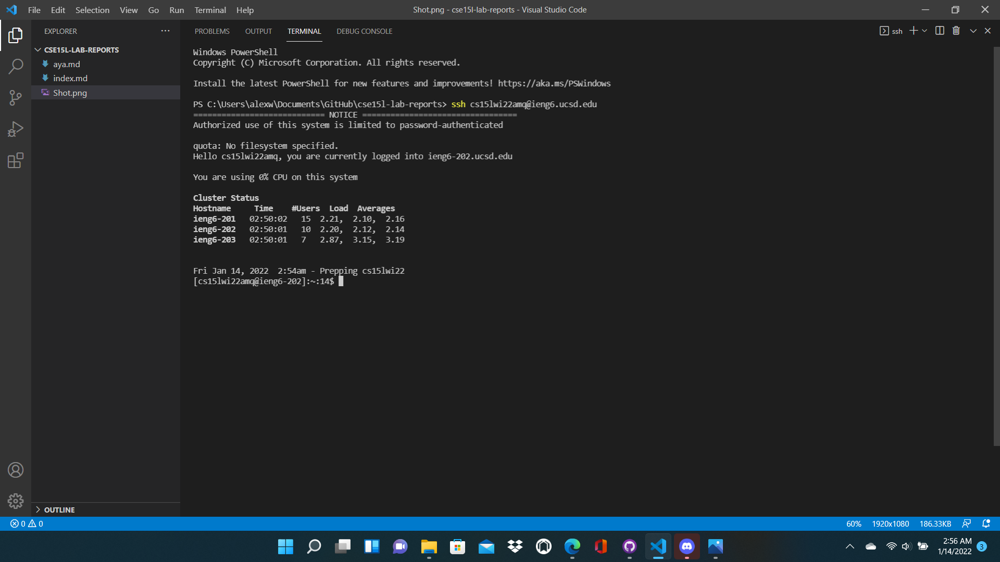

# Week 2 Lab Report
**By Alex Russell**

Tutorial for logging into your course-specific ieng6 account:

## Installing VSCode
Go to [the Visual Studio Code website](https://code.visualstudio.com/) to download the application to your computer. Open it up, and your screen should look similar to the image below.

## Remotely Connecting
If you're on a Windows computer, first make sure [OpenSSH](https://docs.microsoft.com/en-us/windows-server/administration/openssh/openssh_install_firstuse) is installed; then, check your [course account](https://sdacs.ucsd.edu/~icc/index.php). Open a new terminal in VSCode and enter `ssh cs15lwi22zz@ieng6.ucsd.edu` with the *zz* replaced by the letters in your course-specific account. Confirm that you want to connect and enter in your password; you should get messages providing information about the server like in the image below.

## Trying Some Commands
Try some of the following commands, both on the client (your computer) and the server (remote connection). `cd`, `ls`, `pwd`, `mkdir`, and `cp`. Try out different arguments, observe what is outputted, and attempt to produce errors; the result should look something like the image below.

## Moving Files with scp
The terminal command `scp` copies files from your computer to the server. Decide which file on your computer you want to copy over (maybe a simple Java program) and type `scp <file name> cs15lwi22zz@ieng6.ucsd.edu:~/` into the terminal. You will be prompted for your password, and if done correctly, you can log into the server afterwords to see the file with `ls` or run commands such as `javac` and `java` on the file within the server. The following image shows a Java file being run from the server after it was successfully copied over with `scp`.

## Setting an SSH Key
You can use `ssh` keys as substitutes for the password to your course-spceific account. Type `ssh-keygen` in the terminal to create the keys, and then enter in the file location and password associated with the keys (since the purpose of this key is to circumvent a password, I recommend leaving this key's password blank). This step is shown below in the image. Once the key is created, save it to your server account by typing `mkdir .ssh` in the server and `scp <key file directory>cs15lwi22@ieng6.ucsd.edu:~/.ssh/authorized_keys` in the client. At this point you should be able to log into the client without a password.

## Optimizing Remote Running
Some extra tips for optimizing remote running are shown in the following text and image. Write a terminal command in quotes after an `ssh` command to run the quoted command directly on the server before leaving. Also, you can run multiple commands on one line of the terminal by separating the commands with semicolons. Finally, you can pull up the last command that was run by pressing the up arrow on the keyboard while in the terminal.

## Conclusion 
Best of luck completing these tasks! Your peers, course tutors, and instructors are all helpful resources if you get stuck at any point. 
Credit to [original procedure](https://ucsd-cse15l-w22.github.io/week/week1/) for the original lab for these tasks.
