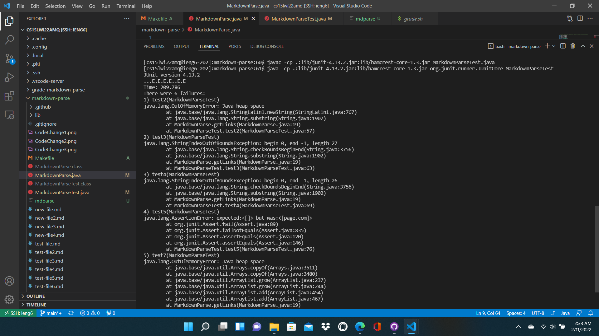
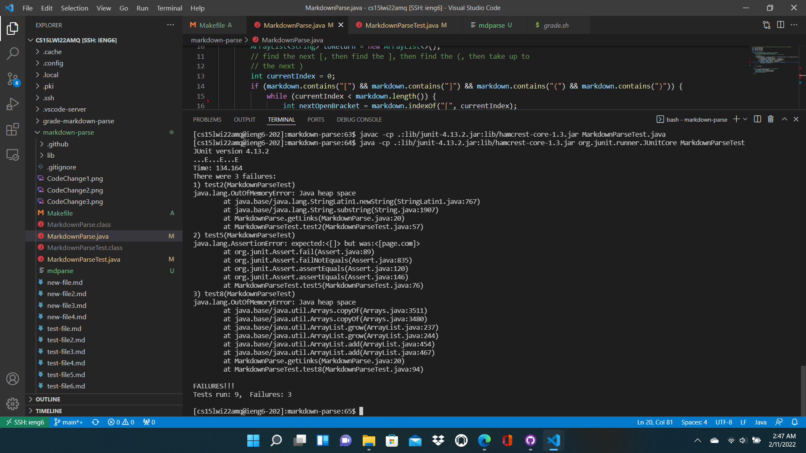
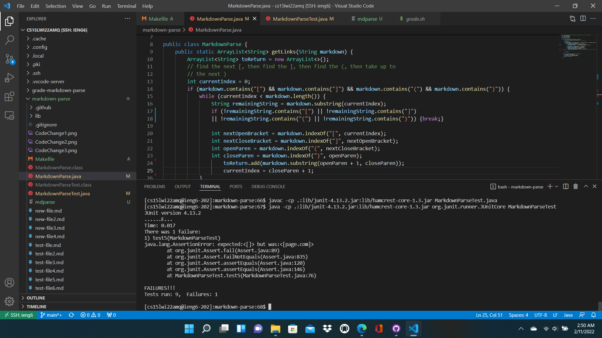

# Week 4 Lab Report
**By Alex Russell**

3 code change commits that fixed bugs in the lab:

## Code Change #1: Adding a Preliminary Check

[**Link**](https://github.com/AlexRussell4/markdown-parse/blob/main/test-file4.md) to the test file (failure-inducing input) that prompted me to make this change.    
The first issue I noticed here was that the method would try to run normally on this file (even though it doesn't have "(" or ")" 

**Output/Symptom:**     
Example of relevant failed test in picture: 3rd failed test (test4 in file)

  
        
**Description**:     
A failure-inducing input resulting from files like test-file4.md is that the method getLinks tries to run normally on a file that can't have any valid links due to not even having the four critical link characters: "**(**" "**)**" "**[**" and "**]**".    
The method getLinks, by default, treats any of those characters as valid parts of a link if they appear in the order sought by the method, but if not all of these characters are actually present in the test file, the symptom StringIndexOutOfBoundsException can result.     
To address this, this code change makes it so that a getLinks call to any test markdown file lacking any of the four key link characters will return an empty ArrayList, avoiding a bug that causes this symptom. 

## Code Change #2: Fixing the Behavior of currentIndex

[**Link**](https://github.com/AlexRussell4/markdown-parse/blob/main/test-file2.md) to the test file (failure-inducing input) that prompted me to make this change.    
An issue I noticed here was that the method would never reach the end of the file or the while loop if there was text after the last link. 

**Output/Symptom:**       
Example of relevant failed test in picture: 1st failed test (test2 in file)    

      
        
**Description**:     
A failure-inducing input resulting from files like test-file2.md is that the method getLinks tries to only consider links even if the markdown file has non-link text after the last link.     .    
The method getLinks, by default, only advances currentIndex if it is passing through a link it found; therefore, non-link text results in the method's while loop never ending, eventually causing the symptom of a OutOfMemoryError.    
To address this, this code change makes it so that after each link is found inside the while loop, the while loop will be broken out of if the remainder of the markdown file after currentIndex lacks any of the four key link characters (see above).   
This avoids the bug where currentIndex only traverses the markdown string through valid links.

## Code Change #3: Clarifying Where to Find a Link

[**Link**](https://github.com/AlexRussell4/markdown-parse/blob/main/test-file5.md) to the test file (failure-inducing input) that prompted me to make this change.    
An issue I noticed here was that the method would identify a link too far after the [] in the markdown file. 

**Output/Symptom:**       
Example of relevant failed test in picture: 1st failed test (test5 in file)    

        
**Description**:     
A failure-inducing input resulting from files like test-file5.md is that the method getLinks tries to pick out a link in () anytime after a link name in [], even if the () is separated from the [] to the point of the characters not resulting in a valid link..    
The method getLinks, by default, looks for a link substring in () anytime after it finds a "[" and a "]", so if a file has a [] with a separated/invalid () after it, the symptom of an incorrectly added link may result.         
To address this, this code change makes it so that getLinks only adds a link if the ()-surrounded link comes immediately after the []-surrounded link name, avoiding the bug where getLinks keep looking for a link url past where it would be appropriate.    

## Conclusion:

These 3 code changes show some of the steps I took while addressing the bugs in labs 3/4.

[Here](https://github.com/ucsd-cse15l-w22/markdown-parse) is a link to the page where I got the test.md files for this lab report.

Disclaimer: Despite passing all 8 of the test files, my code is almost certainly not fully debugged due to that being outside of the scope of this assignment.
