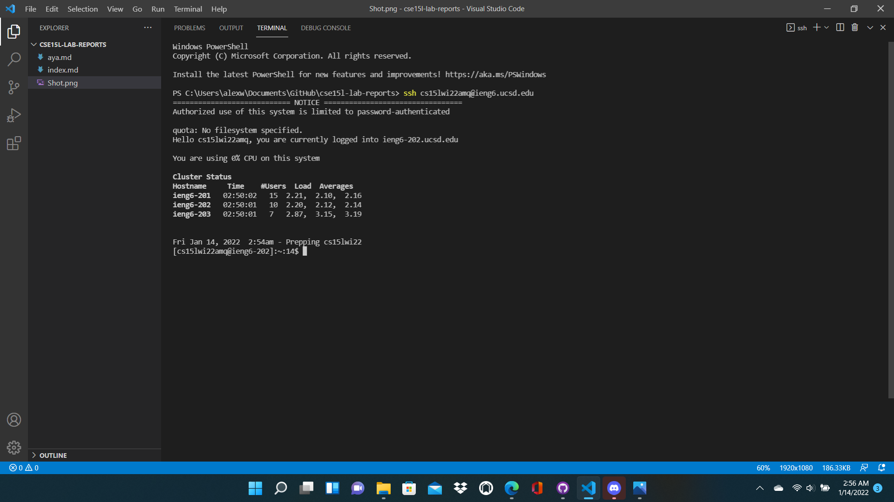

# Week 6 Lab Report
**By Alex Russell**

How I streamlined my `ssh` configuration: 

## blah

## Conclusion: 
With my `ssh` configuration streamlined, it is now less time-consuming to sign in to and work with my course-specific remote account. In combination with the key from week 1 that saves me from needing to enter my password, signing into my remote account is now very fast. Credit to [the original week 5 lab](https://ucsd-cse15l-w22.github.io/week/week5/) for teaching me how to set this up on my computer.
