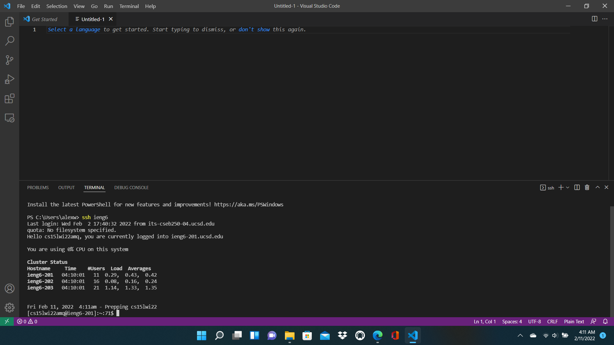

# Week 6 Lab Report
**By Alex Russell**

How I streamlined my `ssh` configuration: 

## Creating and Setting Up My config File

To streamline my ssh login process, I had to first create my `config` file in the `.ssh` folder on my computer because it did not already exist. To do this, as can be seen in the **first image** of this section of the report, I created a new text file named `config` in the `.ssh` folder. As can be seen in the **second image** of this section, I then entered the config information (the host alias, the host name, and my username) by directly editing the text document. After I was done filling out the config text file, I removed the .txt ending from the file. At this point, my setup was complete.     
(**Note**: For the screenshots in this step, I already had my `config` file set up, so I modeled the steps with another file called `config_standin`).

## Logging in With Alias

Since my `config` file was set up at this point, I opened up Visual Studio Code with no project open, created a new terminal, and did `ssh` using the alias for the host: `ssh ieng6`. Since I also have an `ssh` key set up on my computer, I was not prompted for a password, resulting in me immediately being logged in as soon as I entered the `ssh` command with the alias. This terminal interaction can be seen in the **image below**.

## `scp` With Alias

After checking that my `ssh` login process was streamlined, I was then ready to try `scp`-ing a file using the host/server alias. I opened up a test project with a Java file called `Tester.java` in Visual Studio Code. I first showed, with `ls`, that my remote account did not already contain `Tester.java`. Then, I inputted the command `scp src\Tester.java ieng6:` to copy the `Tester.java` file over to the host/server by only using its alias. After the terminal indicated that the operation succeeded, I logged back in to my remote account again and used the `ls` command to show that the `Tester.java` file had been successfully copied over to my remote account. This whole series of terminal commands can be seen in the **image below**.

## Conclusion: 
With my `ssh` configuration streamlined, it is now less time-consuming to sign in to and work with my course-specific remote account. In combination with the `ssh` key from week 1 that saves me from needing to enter my password, signing into my remote account is now very fast. Credit to [the original week 5 lab](https://ucsd-cse15l-w22.github.io/week/week5/) for teaching me how to streamline this process on my computer.
