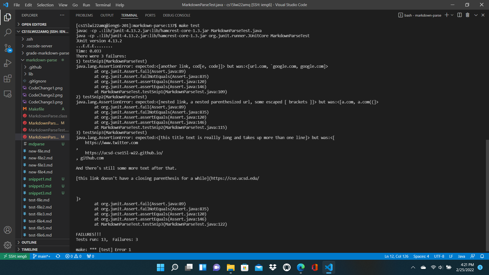

# Week 8 Lab Report
**By Alex Russell**

This report goes over testing and debugging in multiple versions of MarkdownParse. The tests added correspond to the three markdown snippets that can be found in the week 8 lab report [prompt](https://ucsd-cse15l-w22.github.io/week/week8/).

The directories used in this report are [mine](https://github.com/AlexRussell4/markdown-parse) and the one I [reviewed](https://github.com/PierreBeur/markdown-parse) in week 7.

Shown below in the screenshot are the 3 tests used on the 3 code snippets in both MarkdownParseTest files. Both my MarkdownParseTest and the one I reviewed were tested by the 3 JUnit test methods shown in the screenshot, so running the 3 tests shown in the screenshot for both MarkdownParseTests ends up with the total of 6 tests. I'm showing this screenshot here in the beginning to avoid needing to have the same/similar picture 3-6 times in this report.

testSnip1() is used in both MarkdownParseTest files to test the markdown snippet 1 and checks whether the markdown file's "expected result" is outputted. Similarly,  testSnip2()/testSnip3() are tests for the other markdown snippets.

## Snippet 1:

According to the [CommonMark demo site](https://spec.commonmark.org/dingus/), markdown snippet 1 should produce a list of the link(s) ["another link", "cod[e", "code]"].

(see image before the "Snippet 1" header to see the 3 test methods used in both versions of MarkdownParseTest)

**My version** of MarkdownParse did not pass the test for markdown snippet 1, and the JUnit output can be seen in the image below under testSnip1(MarkdownParseTest).

**The version of MarkdownParse that I reviewed** did not pass the test for markdown snippet 1, and the JUnit output can be seen in the image below under testSnip1(MarkdownParseTest)

## Snippet 2:

According to the [CommonMark demo site](https://spec.commonmark.org/dingus/), markdown snippet 2 should produce a list of the link(s) ["nested link", "a nested parenthesized url", "some escaped [ brackets ]"].

(see image before the "Snippet 1" header to see the 3 test methods used in both versions of MarkdownParseTest)

**My version** of MarkdownParse did not pass the test for markdown snippet 2, and the JUnit output can be seen in the image below under testSnip2(MarkdownParseTest).

**The version of MarkdownParse that I reviewed** did not pass the test for markdown snippet 2, and the JUnit output can be seen in the image below under testSnip2(MarkdownParseTest)

## Snippet 3:

According to the [CommonMark demo site](https://spec.commonmark.org/dingus/), markdown snippet 3 should produce a list of the link(s) ["this title text is reallly long and takes up more than one line"].

(see image before the "Snippet 1" header to see the 3 test methods used in both versions of MarkdownParseTest)

**My version** of MarkdownParse did not pass the test for markdown snippet 3, and the JUnit output can be seen in the image below under testSnip3(MarkdownParseTest).

**The version of MarkdownParse that I reviewed** did not pass the test for markdown snippet 3, and the JUnit output can be seen in the image below under testSnip3(MarkdownParseTest)

## Question Reponses:
**Do you think there is a small (<10 lines) code change that will make your program work for snippet 1 and all related cases that use inline code with backticks?**

No, I don't think there is a small change to my program that would make it work for all cases of inline code with backticks. The area between the backticks needs to be treated as a special area in which there can be no links and posseses the ability to legally disrupt pairs of parentheses/brackets, as seen in the expected result of code snippet 1. Keeping track of when the backtick-surrounded areas start and end is almost as complicated of a problem as finding the links bound by brackets/parentheses, so it seems unlikely that such a change could be implemented in under 10 lines of code.

**Do you think there is a small (<10 lines) code change that will make your program work for snippet 2 and all related cases that nest parentheses, brackets, and escaped brackets?**

No, I don't think there is a small change to my program that would make it work for all cases of nested parentheses/brackets, as well as escaped brackets. The escaped brackets issue is seems relatively simple and would likely only take 1 or a few lines of code of the maximum 10 to implement. However, the issue of nested parentheses and brackets is a complicated one, and I feel that one of the best ways to handle pairs of parentheses/brackets would be to use a stack. Since implementing a stack to identify pairs of brackets/parentheses is such a large divergence from my program's current strategy, it would take far more than 10 lines to implement.

**Do you think there is a small (<10 lines) code change that will make your program work for snippet 3 and all related cases that have newlines in brackets and parentheses?**

Yes, I do believe there is a small code that could make my program work for all cases of newlines in brackets and parentheses. The substring found to be between a pair of brackets or parentheses could be checked to see whether it contains newlines or line breaks. As seen in the expected result for code snippet 3, newlines can be valid parts of links while line breaks cannot. Checking for the existence of those features in a substring between two brackets/parentheses would only require simple conditional statements (1 line each), and accounting for either case would not take much code either since the newline case behaves normally and the line break case could probably just simply skip to the next open bracket that could start a link. Overall, these changes could theoretically be implemented in around 10 lines.

## Conclusion:
In the above processes, I have shown how I can go about testing and debugging complicated files like MarkdownParse.

