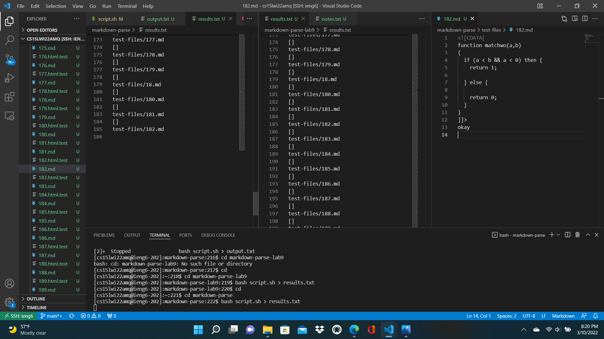
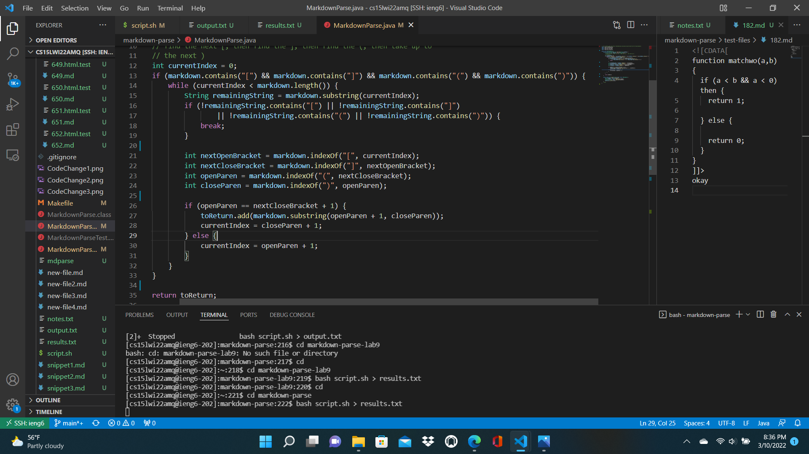
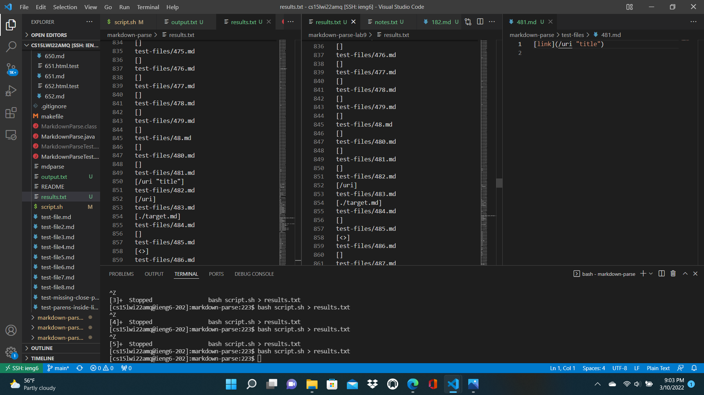
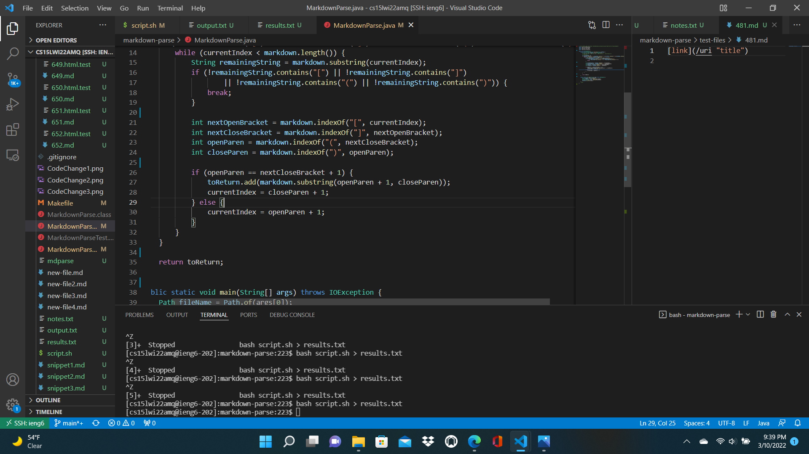

# Week 10 Lab Report
**By Alex Russell**

This report goes over the results of us using the commonmark tests on both a [provided model](https://github.com/ucsd-cse15l-w22/markdown-parse) and our own model of MarkdownParse.
It includes two times when my MarkdownParse and the provided one got different results for commonmark tests.

## First Set of Differing Test Results:

By manually comparing the results of saving the output of `bash script.sh` for both implementations of MarkdownParse, I found that my MarkdownParse encountered an infinite loop for test file 182.md while the provided implementation of MarkdownParse returned an empty list.
By observing test file 182.md, it is clear that there are no valid links in the file; there is never a set of open and closed brackets adjacent to a set of open and closed parentheses. Therefore, the correct output is the empty list, so the provided MarkdownParse implementation was correct while mine has a bug.
The output of my implementation (left) and the output of the given implementation (middle) can be seen in the image below alongside test file 182.md (right).

Now, I will go over the bug(s) in my implementation of MarkdownParse that caused the infinite loop. I'll add at this point that my MarkdownParse is not very complete, so the symptoms I look into in this lab report may result from multiple bugs.
In the picture below, I show my implementation of getLinks() in MarkdownParse (left) alongside the test file 182.md (right).

When the test starts, my implementation first confirms that the  characters are all present in the file, which they are, before entering the while loop.
currentIndex is set to 0 initially. Notably, when searching for the nextCloseBracket, the programs finds te bracket that is near the end of the file and has no open parenthesis after it, resulting in openParen equating to -1. Then towards the end of the loop, since the index of openParen is not right after nextCloseBracket, the program sets currentIndex to openParen+1.
This is a problem, for openParen was -1 after this iteration, so currentIndex remains at 0 indefinitely, resulting in an infinite loop. Specifically, the bug that most directly caused the infinite loop for this test was that my program does not handle the case where openParen equates to -1 well.
Since openParen==-1 indicates that there are no more open parentheses in the file, fixing this bug would likely involve ending the search for links in the test file at that point rather than continuing to search at (openParen==-1)+1 (which does the same loop again from currentIndex==0). This fix could be potentially be done by breaking out of the loop at the end of the loop if openParen==-1.

## Second Set of Differing Test Results:

By manually comparing the results of saving the output of `bash script.sh` for both implementations of MarkdownParse, I found that my MarkdownParse returned a list of links consisting of `/uri "title"` for test file 481.md while the provided implementation of MarkdownParse returned an empty list.
The "correct way" here depends on which behavior you want; my implementation correctly identifies the use of link syntax in 481.md and returns the text from between the parentheses, and the provided implementation likely did not return the text between the parentheses because it identified the text as not providing a proper link.
In this case, I'll argue that my interpretation was the incorrect one because typing in the "link" returned would not be a valid way of getting to a website, so the returned result should've been an empty list (no valid links in the file).
The output of my implementation (left) and the output of the given implementation (middle) can be seen in the image below alongside test file 182.md (right).

Now, I will go over the bug(s) in my implementation of MarkdownParse that caused the infinite loop.
In the picture below, I show my implementation of getLinks() in MarkdownParse (left) alongside the test file 481.md (right).

Wheld likelyopenParen==-1.

